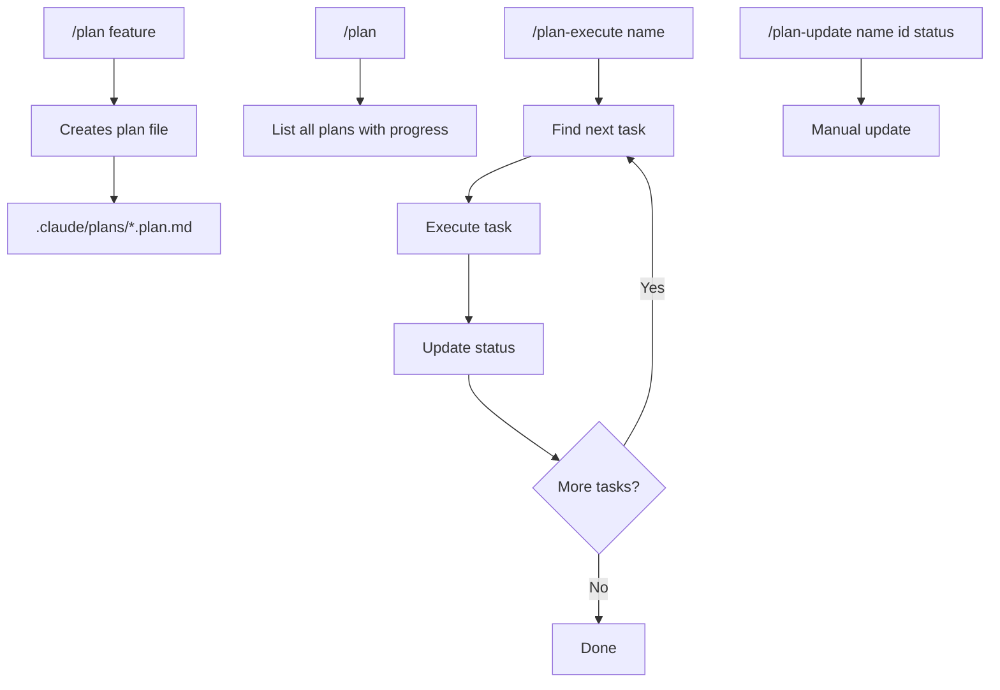

# plan-mode

Plan-based development workflow plugin for Claude Code.

## Installation

Add the marketplace and install:

```bash
/plugin marketplace add quochuydev/x-plan-mode
/plugin install plan-mode@x-plan-mode
```

Or test locally:

```bash
claude --plugin-dir /path/to/x-plan-mode
```

## Getting Started

1. **Create a plan**
   ```
   /plan user authentication
   ```

2. **View plans**
   ```
   /plan
   ```

3. **Execute tasks**
   ```
   /plan-execute user_authentication
   ```

4. **Update progress**
   ```
   /plan-update user_authentication task-id completed
   ```

## Command Flow



## Commands

| Command | Description |
|---------|-------------|
| `/plan` | List all plans |
| `/plan <desc>` | Create new plan |
| `/plan-execute <name>` | Execute next task |
| `/plan-update <name> [id] [status]` | Update status |

## Where Plans Are Stored

Plans are stored in **your project**, not the plugin:

```
your-project/
├── .claude/
│   └── plans/           # Your plans go here
│       └── *.plan.md
└── src/
```

## Plan Format

```yaml
---
name: Feature Name
overview: Brief description
todos:
  - id: task-1
    content: First task
    status: pending
  - id: task-2
    content: Second task
    status: pending
    dependencies:
      - task-1
---

# Feature Name

Implementation details...
```

## Plugin Structure

```
x-plan-mode/
├── .claude-plugin/
│   ├── marketplace.json # Marketplace definition
│   └── plugin.json      # Plugin manifest
├── commands/
│   ├── plan.md
│   ├── plan-execute.md
│   └── plan-update.md
└── skills/
    ├── plan.md
    ├── plan-execute.md
    ├── plan-list.md
    └── plan-update.md
```

## License

MIT
