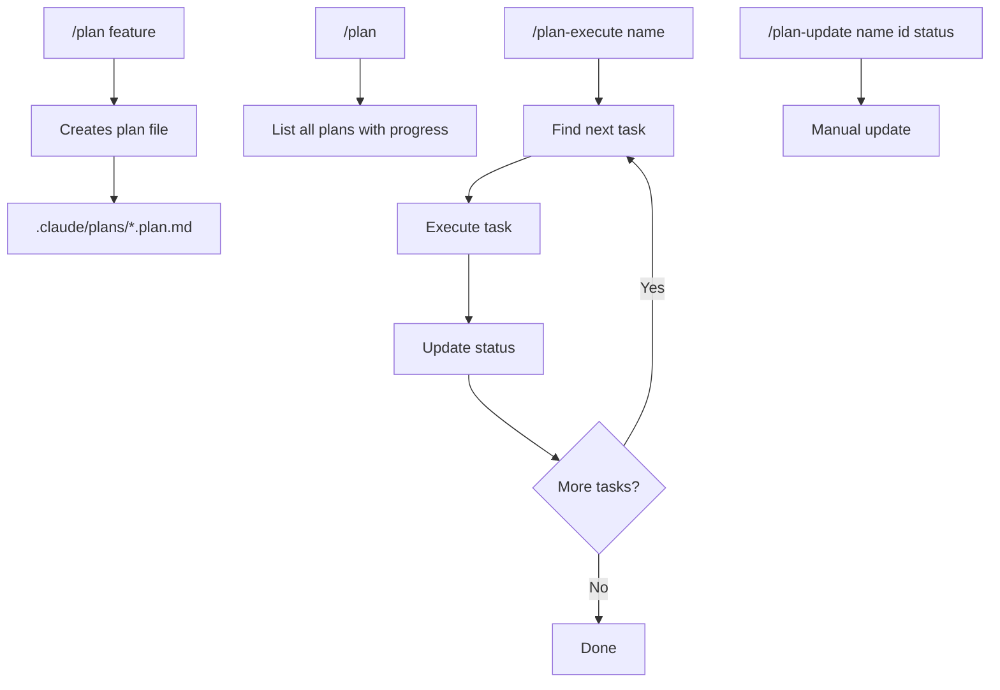

# plan-mode

Plan-based development workflow plugin for Claude Code.

## Installation

Add the marketplace and install:

```bash
/plugin marketplace add quochuydev/x-plan-mode
/plugin install plan-mode@x-plan-mode
```

Or test locally:

```bash
claude --plugin-dir /path/to/x-plan-mode
```

## Getting Started

### Example: Building a REST API with Authentication

1. **Create a plan for your feature**
   ```
   /plan implement JWT authentication with refresh tokens for the Express API
   ```

   This generates `.claude/plans/jwt_authentication.plan.md`:
   ```yaml
   ---
   name: JWT Authentication
   overview: Implement JWT auth with refresh tokens for Express API
   todos:
     - id: setup-deps
       content: Install jsonwebtoken, bcrypt, and cookie-parser packages
       status: pending
     - id: user-model
       content: Create User model with password hashing hooks
       status: pending
       dependencies: [setup-deps]
     - id: auth-middleware
       content: Implement JWT verification middleware
       status: pending
       dependencies: [setup-deps]
     - id: auth-routes
       content: Create /login, /register, /refresh, /logout endpoints
       status: pending
       dependencies: [user-model, auth-middleware]
     - id: protected-routes
       content: Apply auth middleware to protected API routes
       status: pending
       dependencies: [auth-routes]
     - id: tests
       content: Write integration tests for auth flow
       status: pending
       dependencies: [protected-routes]
   ---
   ```

2. **View all plans and progress**
   ```
   /plan
   ```
   Output:
   ```
   Plans:
   ├── jwt_authentication (0/6 tasks) - JWT auth with refresh tokens
   └── database_migration (3/5 tasks) - Migrate to PostgreSQL
   ```

3. **Execute tasks automatically**
   ```
   /plan-execute jwt_authentication
   ```
   Claude will find the next available task (respecting dependencies), implement it, and mark it complete.

4. **Manually update task status**
   ```
   /plan-update jwt_authentication auth-middleware completed
   ```
   Use when you've completed a task outside of `/plan-execute` or need to skip/reset tasks.

## Command Flow



## Commands

| Command | Description |
|---------|-------------|
| `/plan` | List all plans |
| `/plan <desc>` | Create new plan |
| `/plan-execute <name>` | Execute next task |
| `/plan-update <name> [id] [status]` | Update status |

## Where Plans Are Stored

Plans are stored in **your project**, not the plugin:

```
your-project/
├── .claude/
│   └── plans/           # Your plans go here
│       └── *.plan.md
└── src/
```

## Plan Format

```yaml
---
name: Feature Name
overview: Brief description
todos:
  - id: task-1
    content: First task
    status: pending
  - id: task-2
    content: Second task
    status: pending
    dependencies:
      - task-1
---

# Feature Name

Implementation details...
```

## Plugin Structure

```
x-plan-mode/
├── .claude-plugin/
│   ├── marketplace.json # Marketplace definition
│   └── plugin.json      # Plugin manifest
├── commands/
│   ├── plan.md
│   ├── plan-execute.md
│   └── plan-update.md
└── skills/
    ├── plan.md
    ├── plan-execute.md
    ├── plan-list.md
    └── plan-update.md
```

## License

MIT
