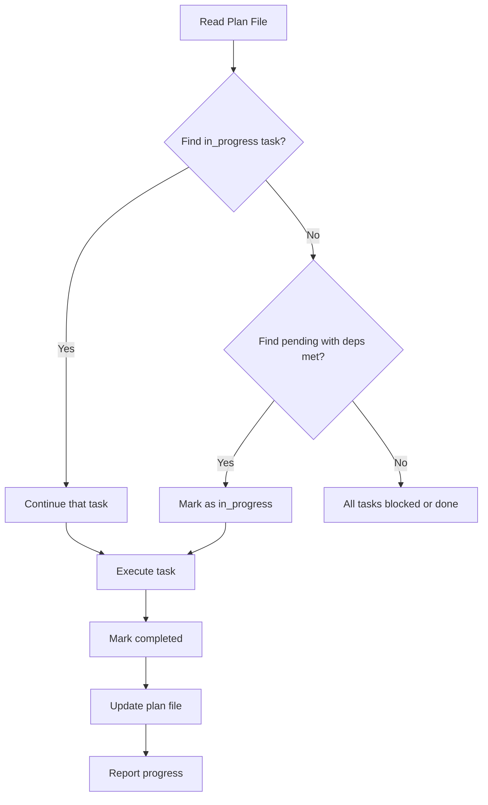

# Plan Execute Skill

Execute implementation tasks from plan files and automatically update their status.

## Usage

```
/plan-execute <plan-file-or-name>     # Execute next pending task
/plan-execute <plan-name> --all       # Execute all remaining tasks sequentially
/plan-execute <plan-name> --parallel  # Execute independent tasks in parallel
```

## Instructions

### Single Task Execution:

1. **Find the plan** - Locate the plan file in `.claude/plans/`
2. **Read current state** - Parse YAML frontmatter to get todos
3. **Identify next task**:
   - First, look for `status: in_progress` tasks
   - If none, find first `pending` task whose dependencies are all `completed`
4. **Execute the task** - Follow the plan's implementation details
5. **Update the plan file**:
   - Mark completed task as `status: completed`
   - Mark next eligible task as `status: in_progress`
6. **Report progress** - Show what was done and what's next

### Parallel Execution (--parallel):

1. Identify all `pending` tasks with no unmet dependencies
2. Spawn background agents for each independent task
3. Wait for completion and update statuses
4. Report all completed tasks

### Full Execution (--all):

Loop through all tasks sequentially until no pending tasks remain.

## Execution Flow



## Plan File Update

After completing a task, edit the YAML frontmatter:

```yaml
# Find this pattern:
  - id: task-id
    content: Task description
    status: in_progress

# Replace with:
  - id: task-id
    content: Task description
    status: completed
```

Then mark the next eligible task as `in_progress`.

## Dependency Resolution

Check dependencies before starting a task:

```yaml
todos:
  - id: jwt-utils
    content: Implement JWT utilities
    status: completed
  - id: login-endpoint
    content: Add login endpoint
    status: pending
    dependencies:
      - jwt-utils  # This is completed, so login-endpoint can start
```

## Example Session

```
> /plan-execute image_resolution_resizing

Reading plan: Image Resolution Resizing
Current progress: 4/8 completed

Next task: cli-resize
  "Add --resize, --resize-fit, --scale, and --resize-method flags to CLI"

Executing...
[Implementation work happens here]

Task completed. Updating plan file.

Progress: 5/8 completed (62%)
Next up: wasm-resize - "Add resizeImage function to WASM API"
```

## Integration with Agents

For complex tasks, spawn a general-purpose agent:

```
Use the Task tool with subagent_type="general-purpose" and prompt:

"Execute the following task from the Image Resolution Resizing plan:
- Task ID: cli-resize
- Content: Add --resize, --resize-fit, --scale, and --resize-method flags to CLI
- Plan details: [include relevant section from plan markdown]

After completing, report what was implemented and any issues encountered."
```

Then update the plan file status yourself after the agent completes.
